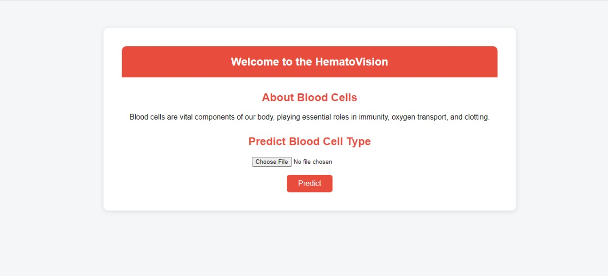
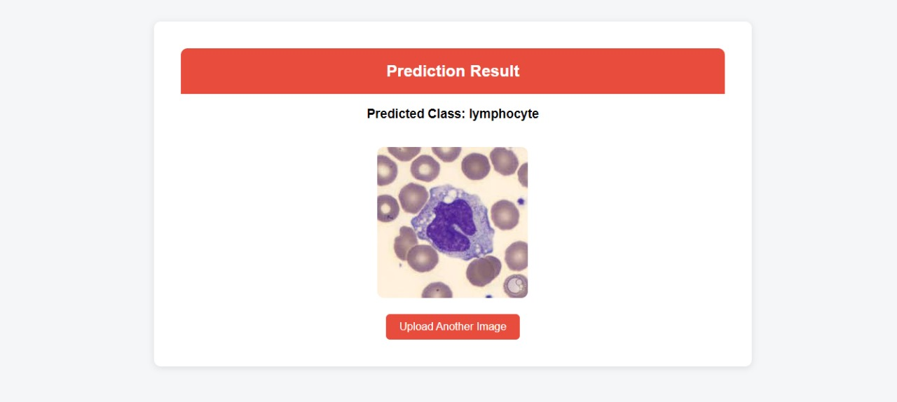

````markdown
# 🩸 HematoVision  
## 🔬 Blood Cell Classification Web App

---

### 📁 **Dataset**

The dataset used is from [Kaggle: Blood Cell Images](https://www.kaggle.com/datasets/paultimothymooney/blood-cells)  
It contains four types of blood cell images organized into `TRAIN` and `TEST` folders.

---

### 🧠 **Model Details**

- **Base Model**: MobileNetV2 (pretrained on ImageNet)  
- **Image Size**: 224x224  
- **Training Tool**: TensorFlow / Keras  
- **Final Format**: `Blood_Cell.h5` (saved model)

---

### 🖥️ **Web App Features**

- Upload a blood cell image  
- Get real-time predictions  
- Clean UI with header and background (HTML/CSS styled)

---

### 🛠️ **How to Run This Project in Google Colab**

1. **Upload the dataset ZIP to your Colab Drive**

2. **Clone this repo**  
   ```bash
   !git clone https://github.com/tejaswiniadam/BloodCellClassifier.git
````

3. **Upload your `.h5` model** if not already present

4. **Install dependencies**

   ```bash
   !pip install flask flask-ngrok pyngrok opencv-python pillow
   ```

5. **Run the Flask app**

   ```python
   from pyngrok import ngrok  
   ngrok.set_auth_token("YOUR_AUTH_TOKEN")  # Get it from https://dashboard.ngrok.com/get-started/setup  
   !python app.py
   ```

---

### 🧪 **How to Run Locally (Optional)**

```bash
git clone https://github.com/tejaswiniadam/BloodCellClassifier.git
cd BloodCellClassifier
pip install -r requirements.txt
python app.py
```

---

### 🖼️ **Sample UI Screenshots**

#### 📤 Upload Page



#### ✅ Prediction Result Page



📌 These screenshots demonstrate how a user uploads a blood cell image and receives predictions using the HematoVision web app.

---

### 📂 **Folder Structure**

```
├── app.py               # Flask app  
├── Blood_Cell.h5        # Trained model  
├── templates/           # HTML templates (home.html, result.html)  
├── dataset/             # TRAIN/TEST folders (optional)  
├── requirements.txt     # Dependencies  
├── README.md            # Project documentation  
├── assets/              # UI screenshot images  
```

---

### 🚀 **Deployment Suggestion**

* For online deployment: use platforms like **Render** or **Railway**
* For demo purposes: continue with **Google Colab + ngrok**

---

### 📬 **Contact**

* Made with ❤️ by **Adam Tejaswini**
* 📧 Email: [adamtejaswini1432@gmail.com](mailto:adamtejaswini1432@gmail.com)

```

